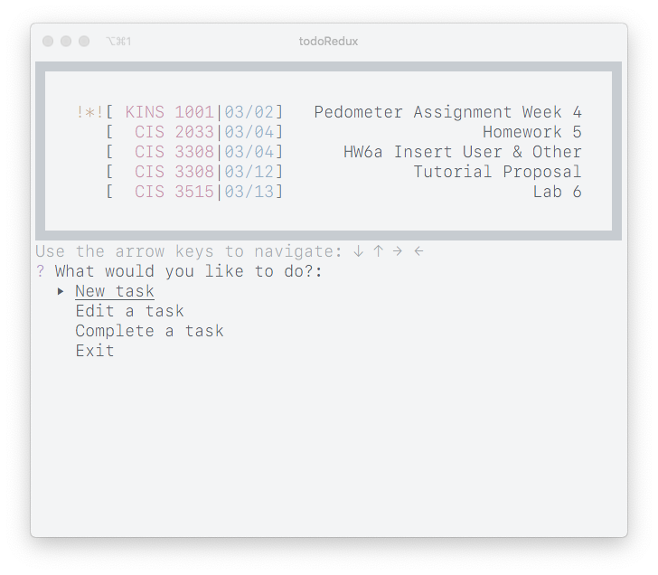

# todoRedux

A CLI todo list app with somewhat of an emphasis on *a e s t h e t i c s*. A successor to my [todo app](https://github.com/sgnu/todo).


## Installation

todoRedux can be installed using the command:

```sh
go get github.com/sgnu/todoRedux
```

You will need to create a tasks file (with no extension) in your `$GOPATH` directory. It can be empty, but the file must exist.

## Usage

Using this app is pretty self explanatory:

- Add a task
  - Adds a new task to the list
- Edit a task
  - Edits a task that is on the list
- Complete a task
  - Completes and removes a task that is on the list
- Exit
  - Closes the app
